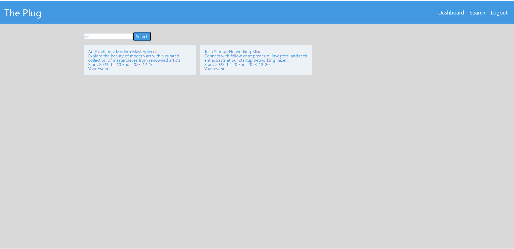

# The Plug

## Description

The Plug event planner offers a streamlined dashboard for users to explore upcoming events, seamlessly displaying event details in centered modals upon a simple click, enhancing the overall user experience.

## Table of Contents
- [Installation](#installation)
- [Usage](#usage)
- [Credits](#credits)
- [License](#license)

## Installation

- JSON:[ JSON](https://www.npmjs.com/package/json)
- Dynamic JavaScript
- Node.js [Version 16.18.1](https://nodejs.org/en/blog/release/v16.18.1/)
- Express.js:[Express.js](https://expressjs.com/en/starter/installing.html)
- Connect Session Store using Sequelize: [7.0.4](https://www.npmjs.com/package/connect-session-sequelize)
- Dotenv: [8.6.0](https://www.npmjs.com/package/dotenv)
- Express: [4.17.1](https://www.npmjs.com/package/express)
- Express Handlebars: [5.2.0](https://www.npmjs.com/package/express-handlebars)
- Express-Session: [1.17.1](https://www.npmjs.com/package/express-session)
- Handlebars.js: [4.7.6](https://www.npmjs.com/package/handlebars)
- Node MySql2: [2.3.3](https://www.npmjs.com/package/mysql2)
- Sequelize: [6.29.3](https://www.npmjs.com/package/sequelize)
- License Badge: [Shields.io](https://shields.io/)
- Visual Studio Code: [Website](https://code.visualstudio.com/)

## Usage

[The Plug](https://github.com/Krich2022/The_Plug)
Visit the homepage, "Login" or "Sign Up" for an account if you don't already have one.
Option: A) Account login: click on "login" in the navigation menu - enter Username and Password then click "Sign In" to proceed.
Option: B) Account Sign Up: click on "Sign Up" in the navigation menu - once open, enter Username, Email and Password then click "Sign Up" to proceed.
Once you have an account, you can search or create events in your area.

## Credits
Collaborators:
Keston Rich: [GitHub](https://github.com/Krich2022)
Devan Ash: [GitHub](https://github.com/DAsh365)
Stretch Spelman: [GitHub](https://github.com/StretchSpelman)
Lucas Gilles: [GitHub](https://github.com/LonliLucas)
Juan Jimenez: [GitHub](https://github.com/JJTheDev)

APIs:
Email API: [Twilio SendGrid](https://sendgrid.com/en-us)
CSS Framework: [Tailwind CSS](https://tailwindcss.com/)
Wireframe: [Figma](https://www.figma.com/)

## License

Please refer to the LICENSE in the repo.